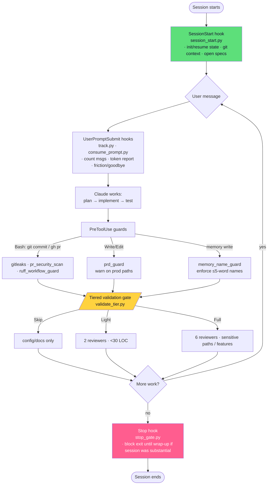

# 🛠️ claude-craft-kit

[](https://effecet.github.io/claude-craft-kit/)
[](LICENSE)
[](https://docs.claude.com/en/docs/claude-code)
[](hooks/)
[](#)
[](#)

An opinionated, batteries-included **workflow harness for [Claude Code](https://docs.claude.com/en/docs/claude-code)** —
the hooks, rules, and lifecycle that turn an agent session into a disciplined
engineering loop: **pre-tool safety guards → a tiered validation gate →
an exit/wrap-up gate**, all driven by a set of behavior rules.

It's a **template**: fork it, drop the hooks into your `~/.claude`, wire them in
`settings.json`, and adapt the rules to your stack. Everything runs locally with
no dependencies beyond Python 3 + bash. An optional memory backend is supported
but **off by default**.

## The lifecycle

**▶ [See it animated →](https://effecet.github.io/claude-craft-kit/)** — an interactive, click-through version of the flow below (auto-plays a session through the hooks).



See **[docs/WORKFLOW.md](docs/WORKFLOW.md)** for the full walkthrough and the validation-tier rules.

## What's inside

**Hooks** (`hooks/`) — the lifecycle machinery:

| Stage | Hook | Does |
|---|---|---|
| SessionStart | `session_start.py` | Init/resume session state, git context, surface open specs |
| UserPromptSubmit | `track.py`, `consume_prompt.py` | Message counting, token report, friction/goodbye detection, pending prompts |
| PreToolUse | `gitleaks_guard.sh`, `pr_security_scan.sh` | Block commits/PRs that leak secrets |
| PreToolUse | `prd_guard.sh` | Warn before editing prod-looking paths |
| PreToolUse | `ruff_workflow_guard.py` | Ruff check before committing in CI repos |
| PreToolUse | `memory_name_guard.py` | Enforce a memory-naming convention |
| (gate) | `validate_tier.py` | Pick the review tier from diff size + sensitive paths |
| Stop | `stop_gate.py` | Block a clean exit until wrap-up runs on substantial sessions |
| idle | `on_idle.sh` | Nudge a wrap-up after inactivity |
| helpers | `_state.py`, `common.py`, `spec_audit.py` | Shared state schema, path helpers, spec reporting |

**Rules** (`rules/`) — the behavior the hooks enforce: `development.md` (the
validation gate + TDD), `operations.md` (proposal gate, git safety), `memory.md`,
`project-hygiene.md`, `context7.md`, `data-engineering.md`, `typescript.md`,
`supabase.md`, `tooling.md`, `npm-cache-eperm.md`.

**Optional memory backend** (`hooks/optional/`) — `proactive_recall.py` and
`backup_hook.py`, inert unless `BRAIN_ENABLED=true`. Wire them to any
Postgres-backed memory store; a reference implementation is
[**memory-persistor**](https://github.com/effecet/memory-persistor).

## Quick start

```bash
# 1. Install hooks + rules into ~/.claude (override with CLAUDE_DIR=...)
make install

# 2. Configure (edit paths/flags to taste)
cp config.example.sh ~/.claude/config.local.sh   # then source it from your shell profile

# 3. Wire the hooks — merge settings.example.json's "hooks" block into ~/.claude/settings.json

# 4. (optional) adopt the global instructions
#    review CLAUDE.example.md, then save it as ~/.claude/CLAUDE.md
```

Other targets: `make syntax` (check all hooks), `make lint` (ruff + shellcheck),
`make scan` (gitleaks), `make help`.

Nothing phones home; the brain-coupled features stay dormant until you opt in.

## Project structure

```
claude-craft-kit/
├── README.md
├── index.html                  # interactive animated lifecycle (the Pages site)
├── LICENSE                     # MIT
├── Makefile                    # install / syntax / lint / scan
├── CLAUDE.example.md           # generified global-instructions skeleton
├── config.example.sh           # env config (paths, BRAIN_ENABLED, backend)
├── settings.example.json       # Claude Code hook wiring
├── .gitleaks.toml              # secret-scan config
├── docs/
│   └── WORKFLOW.md             # the full lifecycle + validation-tier rules
├── hooks/
│   ├── session_start.py        # SessionStart: state, git context, specs
│   ├── track.py                # UserPromptSubmit: counting, tokens, friction
│   ├── consume_prompt.py       # UserPromptSubmit: surface pending prompts
│   ├── validate_tier.py        # the tiered validation gate
│   ├── stop_gate.py            # Stop: wrap-up exit gate
│   ├── gitleaks_guard.sh       # PreToolUse: secret scan before commit
│   ├── pr_security_scan.sh     # PreToolUse: secret scan before PR
│   ├── prd_guard.sh            # PreToolUse: prod-path warning
│   ├── ruff_workflow_guard.py  # PreToolUse: ruff before commit
│   ├── memory_name_guard.py    # PreToolUse: memory-name convention
│   ├── on_idle.sh              # idle: wrap-up nudge
│   ├── spec_audit.py           # report open specs
│   ├── _state.py               # session-state schema
│   ├── common.py               # path helpers
│   └── optional/               # backend-coupled, BRAIN_ENABLED=false by default
│       ├── proactive_recall.py # surface relevant memories per prompt
│       └── backup_hook.py      # generic git backup of your config
└── rules/                      # the 10 behavior rules
```

## License

MIT — see [LICENSE](LICENSE).
