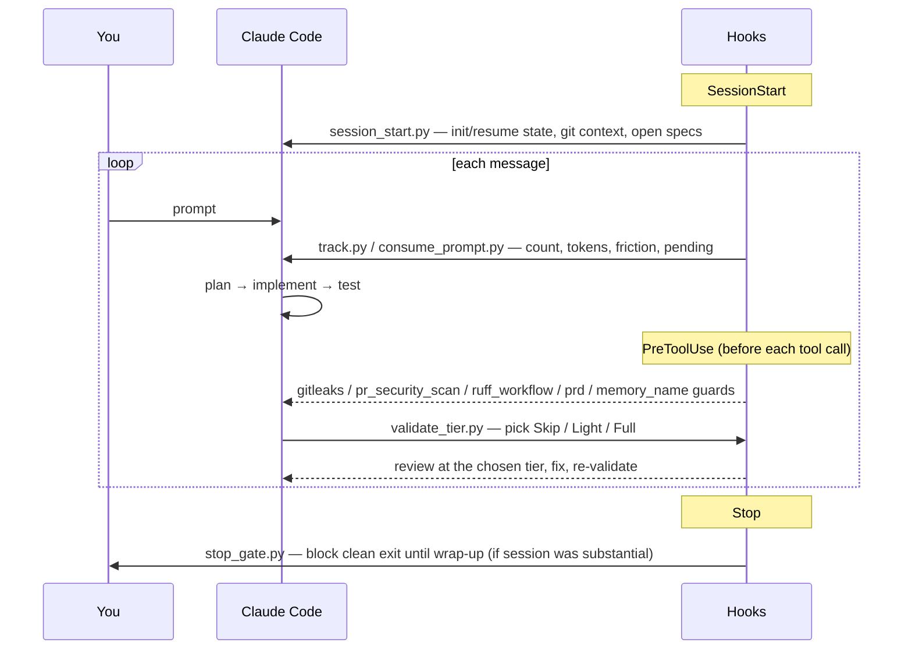

# The claude-craft-kit workflow

This is the lifecycle the hooks + rules enforce. The goal: turn a free-form agent
session into a disciplined loop with safety guards on the way in, a review gate
in the middle, and a wrap-up gate on the way out.

## Lifecycle stages



### 1. SessionStart — `session_start.py`
Initializes or resumes session state (`~/.claude/session/state.json`), prints git
context, and surfaces open specs. Optional brain steps (sync, decay) run only when
`BRAIN_ENABLED=true`.

### 2. Per message — `track.py`, `consume_prompt.py`
Counts user messages, reports token usage, detects friction and "goodbye" phrases
(to offer wrap-up), and surfaces any pending prompt written by a prior hook.

### 3. PreToolUse guards
Fire **before** a tool call lands, and can block it:
- `gitleaks_guard.sh` — scans staged changes for secrets before `git commit`.
- `pr_security_scan.sh` — scans the branch diff before `gh pr create`.
- `ruff_workflow_guard.py` — runs `ruff check` before committing in CI repos.
- `prd_guard.sh` — warns before editing prod-looking paths.
- `memory_name_guard.py` — enforces a memory-naming convention (≤5-word names).

### 4. The tiered validation gate — `validate_tier.py`
After code changes, this script reads the diff and recommends a review tier instead
of eyeballing it:

| Tier | Criteria | Reviewers |
|---|---|---|
| **Skip** | config/docs only, no testable code | none |
| **Light** | < 30 LOC changed, no sensitive paths | 2 (code-reviewer, bug-hunter) |
| **Full** | ≥ 30 LOC, or plan steps, or sensitive paths, or explicit request | all 6 reviewers |

```bash
python3 hooks/validate_tier.py HEAD        # working-tree changes
python3 hooks/validate_tier.py --staged    # staged changes
```
Sensitive-path patterns (`auth`, `payment`, `migration`, `secret`, …) auto-escalate
to Full. The script also scans for forbidden markers and exits non-zero to block.

### 5. Stop — `stop_gate.py`
On a substantial session (configurable message threshold), blocks a clean exit until
a wrap-up has run, so learnings and commits aren't lost. `on_idle.sh` nudges the same
after inactivity.

## The rules

The hooks enforce structure; the rules (`rules/`) define the behavior:
- **`development.md`** — the validation gate above + TDD discipline + the scale-to-complexity sizing rule.
- **`operations.md`** — the proposal gate (confirm before file/git/deploy ops), commit format, git safety.
- **`project-hygiene.md`** — README/Makefile/diagram upkeep before commits.
- **`memory.md`** — when and how to capture learnings to a memory backend.
- **`context7.md`, `data-engineering.md`, `typescript.md`, `supabase.md`, `tooling.md`, `npm-cache-eperm.md`** — stack and tooling conventions.

Adopt them by importing from your `CLAUDE.md` (see `CLAUDE.example.md`).

## Optional: wiring a memory backend

The brain-coupled hooks (`hooks/optional/proactive_recall.py`, `backup_hook.py`, and
the brain steps inside `session_start.py`/`track.py`) are **inert by default**. To
enable:

1. Set `BRAIN_ENABLED=true` and `DATABASE_URL=…` in your config (see `config.example.sh`).
2. Stand up a Postgres-backed memory store. A ready-made one:
   [**memory-persistor**](https://github.com/effecet/memory-persistor) — a memory MCP
   server with thermal decay and a knowledge graph.
3. `proactive_recall.py` then surfaces relevant memories on each prompt; `backup_hook.py`
   does a generic `git` backup of your config dir to a remote you configure.

Until you do that, everything runs standalone — no DB, no network.
